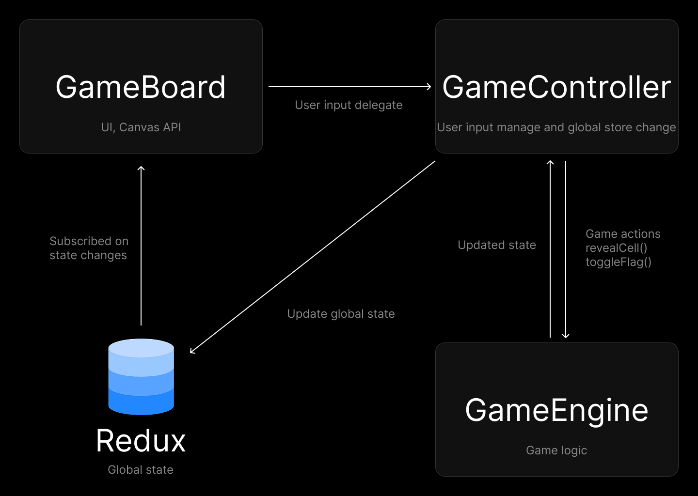
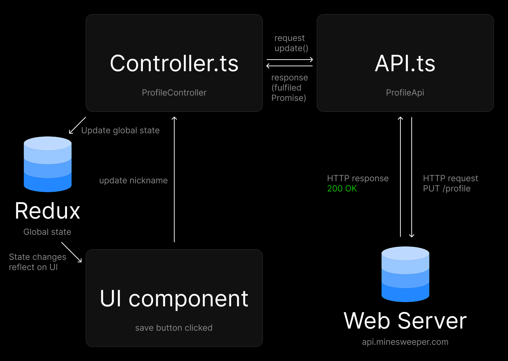

# Техническая документация: Minesweeper game

## 1. Общая информация
Minesweeper game — это классическая 2D-игра с разными уровнями сложности. Разработка ведётся с использованием современных технологий, включая React, TypeScript, Vite, Redux и Canvas API. Бэкенд реализован на Node.js с PostgreSQL и Sequelize. Игра имеет доску рекордов и встроенные форумы для обсуждения.

### Клиентская часть
- [Технологии](#21-технологии)
- [Архитектура игры](#23-архитектура-игры)
- [Общие концепции ахитектуры игры](#component-interaction-summary)

### Серверная часть
- [Технологии](#31-технологии)
- [API эндпоинты](#32-API-эндпоинты)

### Дальнейшие шаги
- [Безопасность](#4-Безопасность)
- [Развёртывание](#5-Развёртывание)
- [Дальнейшее развитие](#6-Дальнейшее-развитие)


---

## Сценарий игры

В начале игры отображается игровое поле с закрытыми клетками. Табло показывает общее количество непомеченных мин и время игры.
Когда игрок делает первый клик по одной из клеток, открывается несколько пустых клеток и клеток с числами. Число на клетке обозначает количество мин вокруг неё, то есть в области 3×3 с центром в этой клетке.
Используя подсказки, игрок определяет точное местонахождение мин, помечая их флажком и открывая клетки без мин. Пометив все мины вокруг числовой клетки, игрок может разом открыть все оставшиеся клетки вокруг неё, нажав на это число.
Для победы необходимо открыть все клетки без мин. В случае, если игрок открывает клетку с миной, игра заканчивается поражением.

---

## 2. Клиентская часть приложения
### 2.1 Технологии
- **React** (фреймворк для построения пользовательского интерфейса)
- **React Router** (routing)
- **Redux Toolkit** (state manager)
- **Zod** (валидация форм)
- **React Hook Form** (сбор данных с форм)
- **Tailwind** (стили)
- **Axios** (работа с сетевыми запросами)
- **Lefthook** (Добавление хуков для автоматизации, pre-commit, pr-checks)
- **TypeScript** (статическая типизация)
- **Vite** (система сборки)
- **Canvas API** (отрисовка игрового поля)
- **Service Workers** (автономная работа игры без интернета)

### 2.2 Scripts

- `npm run build` — build project
- `npm run lint` — run ESLint
- `npm run format` — run Prettier
- `npm run test` — run Jest

---

### 2.3 Архитектура игры

### GameBoard.tsx (Компонент рендера игрового поля)
- Отрисовывает поле с помощью **Canvas API**
- Подписывается на глобальное состояние Redux (`CellData[][]`)
- Делегирует события кликов в `GameController.ts`

### GameController.ts (Компонент управления игрой)
- Обрабатывает пользовательские взаимодействия
- Обновляет глобальное состояние **Redux** на основе данных из GameEngine.ts
- Связывает UI и игровую логику

### GameEngine.ts (Игровая логика)
- Управляет расстановкой мин, открытием клеток и постановкой флагов
- Обрабатывает игровые события, включая завершение игры
- Содержит алгоритмы генерации и обновления игрового поля

## GameBoard.tsx

### **React component: `GameBoard`**
Ответственнен за render игрового поля с помощью Canvas API.

### **State**
- Подписывается на global Redux game state (`CellData[][]`).

### **Methods**

**`renderBoard(state: GameState): void`** - Рисует игровое поля основываясь на текущем состоянии

**`onCellClick(x: number, y: number): void`** - Вызывается при клике на клетку, делегирует действие `GameController.ts`

**`onRightClick(x: number, y: number): void`** - Вызывается при правом клике на клетку, делегирует действие `GameController.ts`

### **Event Handling**
- Пользовательские клики обрабатываются в `GameController.ts`. `GameBoard.tsx` отражает только изменения из state.

## GameController.ts

### **Component: `GameController`**
Обрабатывает пользовательские взаимодействия, вызывая соответствующие интерфейсы в `GameEngine`.
Также обновляет global state, после получения измененного состояния от `GameEngine`.
Выступает связующим звеном между UI и игровой логикой.

### **State**
- Использует Redux для обновления global game state (`CellData[][]`).

### **Event Handlers**

**`handleCellClick(x: number, y: number): void`** - обрабатывает клик и вызывает соответствующий метод из `GameEngine`.

**`handleRightClick(x: number, y: number): void`** - обрабатывает клик и вызывает соответствующий метод из `GameEngine`.

**`restartGame(): void`** - перезапускает игру взаимодействуя с `GameEngine` и обновляя global game state.

## GameEngine.ts

### **Class: `GameEngine`**
Содержит игровую логику, такую как: расстановку мин, раскрытие клеток и расстановку флагов, содержит методы для управления `GameBoard.tsx`.

### **Constructor**
```ts
constructor(rows: number, cols: number, mines: number)
```
Создает игровое поле с рандомно расположенными минами.

### **Methods**

**`revealCell(x: number, y: number): GameState`** - Открывает клетку по координатам.
- Игнорирует клетки с флагами.
- Если клетка рядом не содержит мины, процесс повторится для нее (recursively), и так до клетки с миной.
- Триггерит game-over state если клетка с миной.

**`toggleFlag(x: number, y: number): GameState`** - Ставит/убирает flag с клетки.
- Флаг можно поставить только на нераскрытую клетку.

**`isGameOver(): boolean`** - Проиграна ли игра

**`getState(): GameState`** - Возвращает текущее состояние игры

### **Interface: `CellData`**
```ts
interface CellData {
    isRevealed: boolean;
    isMine: boolean;
    isFlagged: boolean;
    surroundingMines: number; // Number of mines connected to the cell (3x3 around)
}
```

### **Type: `GameState`**
```ts
type GameState = CellData[][] // Game Fielld 2D representation
```



---

## Component Interaction Summary

1. **Пользователь кликает на клетку** → `GameController.ts` перехватывает клик и `GameEngine.ts` управляет логикой.
2. **`GameController.ts` обновляет state** полученный от `GameEngine.ts`.
3. **Обновленное состояние хранится в Redux**.
4. **`GameBoard.tsx` ожидает изменений state** и ререндерит поле согласно изменениям.

---

### 2.4 API-клиент
Работа с сетевыми запросами делится на `Controllers` и `APIs`.
- `APIs` — Делают только сетевые запросы. Они должны вернуть данные, полученные после запроса, никак не обрабатывая их.
- Имеют интерфейсы `create`, `request`, `update`, `delete` и используются контроллерами.
Хранятся в папке `/api` находящиеся в корневой папке с ресурсами, или в папке с компонентом (если API специфичный и используется только этим компонентом). Примеры названий `UserApi.ts`, `AvatarApi.ts`.
- `Controllers` — Работают с данными и обновляют state. Используют `APIs` для получения данных с сервера.
Методы контроллера часто вызываются UI-компонентом или другим контроллером.
Хранятся в папке `/сontrollers` находящиеся в корневой папке с ресурсами, или в папке с компонентом (если controller специфичный и используется только этим компонентом). Примеры названий `SessionController.ts`, `ProfileController.ts`.



---

### 2.5 Авторизация
После успешной авторизации `AuthController` должен обновить статус авторизации в global state.
React Router должен ориентироваться на global state и после изменения статуса разрешать пользователю открывать страницы, требующие авторизации.

---

## 3. Серверная часть
### 3.1 Технологии
- **Node.js** (серверная среда выполнения JavaScript)
- **Express.js** (фреймворк для API)
- **PostgreSQL** (реляционная база данных)
- **Sequelize** (ORM для PostgreSQL)
- **OAuth** (аутентификация пользователей)

### 3.2 API-эндпоинты
#### Пользовательская аутентификация
- `POST /api/auth/register` — регистрация пользователя.
- `POST /api/auth/login` — вход в систему.
- `POST /api/auth/logout` — выход из системы.

#### Профиль
- `GET /api/user` — получение данных о пользователе.
- `PUT /api/user` — обновление профиля.
- `PUT /api/avatar` — загрузка нового аватара.
- `DELETE /api/avatar` — удаление аватара.

#### Лидерборд
- `GET /api/leaderboard` — получение списка лидеров.
- `POST /api/leaderboard` — добавление нового рекорда.

#### Форум
- `GET /api/forum/topics` — полученить список тем форума.
- `POST /api/forum/topics` — создание новой темы.
- `POST /api/forum/topics/{topic_id}/comment` — добавление комментария.

### 3.3 Пример API-контроллера
```ts
import express from 'express';
import { getLeaderboard } from '../services/leaderboardService';

const router = express.Router();

router.get('/leaderboard', async (req, res) => {
  const leaderboard = await getLeaderboard();
  res.json(leaderboard);
});

export default router;
```

## 4. Безопасность
- **OAuth** для аутентификации.
- **Защита от XSS и SQL-инъекций**.
- **CSP** для предотвращения внедрения вредоносных скриптов.

## 5. Развёртывание
- Клиентская часть хостится на Yandex.Cloud.
- Серверная часть развернута на DigitalOcean.
- PostgreSQL развернута на отдельном сервере.
- Nginx настроен с поддержкой HTTP/2 и HTTP/3 (QUIC), сжатие GZIP.

## 6. Дальнейшее развитие
- Добавление онлайн функционала с помощью WebSocket.
- Оптимизация UI/UX.
- Адаптация под мобильные устройства.
- Улучшение производительности и устранение утечек памяти.

Этот документ описывает текущую архитектуру проекта, его ключевые компоненты и направления развития. Он поможет команде структурировать процесс разработки и обеспечит единообразный подход к коду.
