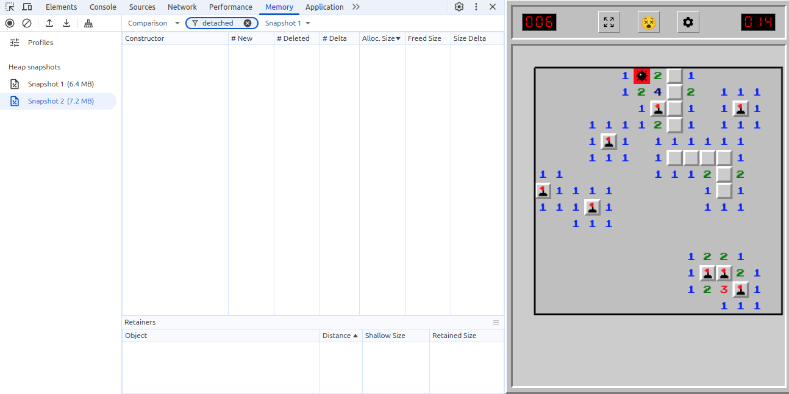
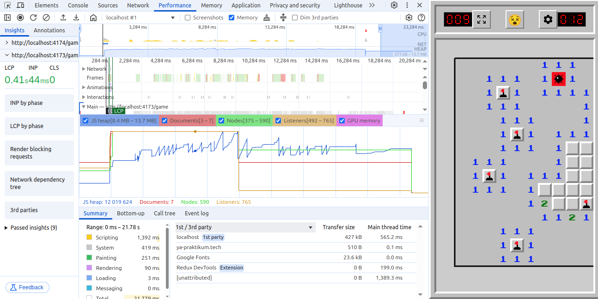
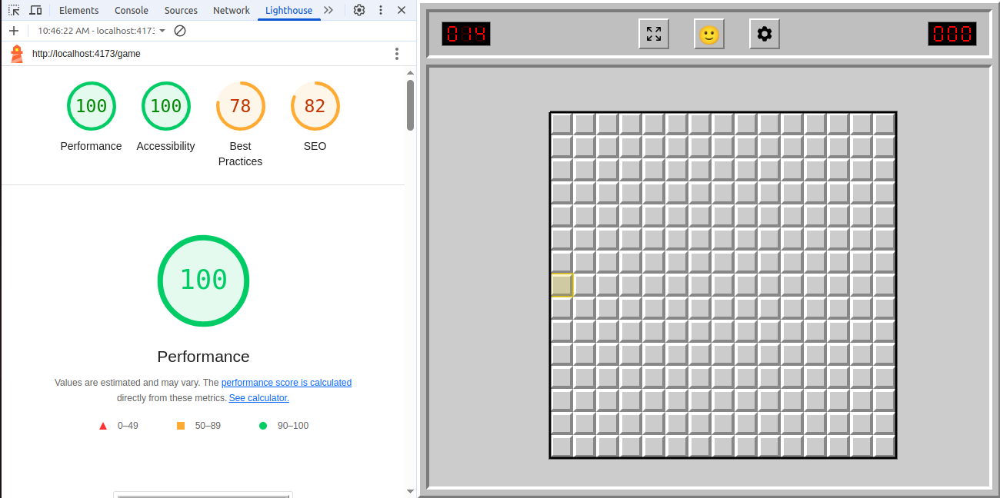

# Анализ утечек памяти в приложении

Анализ проводился в браузере **Google Chrome** с использованием встроенных инструментов: вкладок **Memory**, **Performance** и **Lighthouse**.

---

## Процесс анализа

### 1. Вкладка **Memory** (Heap Snapshots)

- Сравнение двух снимков памяти:
  - **Снимок 1:** начало игры — `6.4 MB`
  - **Снимок 2:** окончание игры — `7.2 MB`
- Прирост памяти составил ~ `800 KB` при длительности игровой сессии в 14 секунд.
- **Отсутствие `detached` DOM-узлов** указывает на корректное освобождение ресурсов — удалённые элементы не удерживаются в памяти.

---

### 2. Вкладка **Performance**

- В процессе игры:
  - Куча выросла с `9.2 MB` до `13.7 MB` (пик)
  - Затем снизилась до `8.4 MB`
- Рост связан с ререндерами страницы `Game` и созданием временных объектов.
- **Снижение после пика** — индикатор того, что сборщик мусора эффективно очищает неиспользуемые данные.

---

### 3. Lighthouse

- Производительность страницы игры по метрикам Google Lighthouse составила **100 баллов**, что подтверждает оптимальную реализацию и отсутствие утечек на уровне рендеринга и загрузки.

---

## Итоги

- Все **обработчики событий и таймеры**, добавляемые через `useEffect`, корректно удаляются при размонтировании компонентов.
- Компоненты React **удаляются из дерева** без остаточных ссылок, память эффективно очищается.
- Приложение демонстрирует **высокую производительность и стабильность**.
